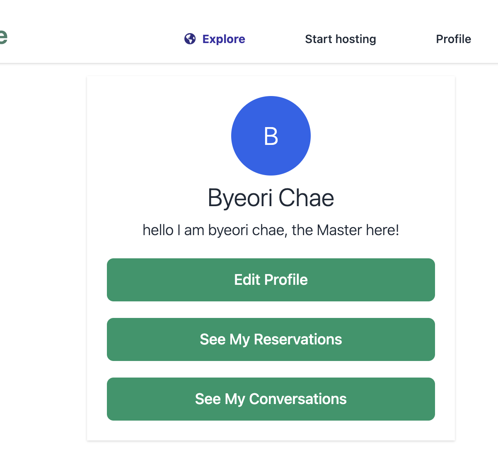
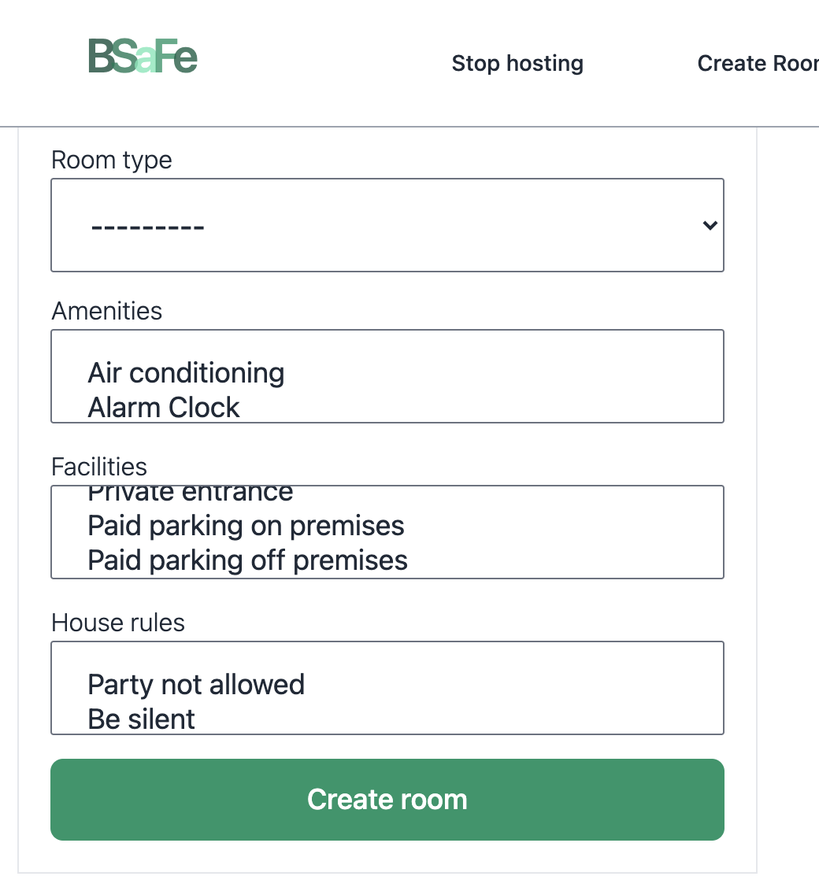

## 숙소 예약 웹사이트

with Python, Django, Tailwind Css

### home

#### See the all rooms available with pagination

#### 

### User Login, Logout & SignUp

#### social(github/kakao) login or email login

#### 

### User Profile

#### 

### Become a Host and Upload a New Room

#### 

### Room Detail

#### Room information and Reservation calendar

### Reservation Detail

#### 

### Messages

#### can send messages between host & guest

### 

### Favorite Lists

#### add or remove rooms from user favorite rooms list

#### 
