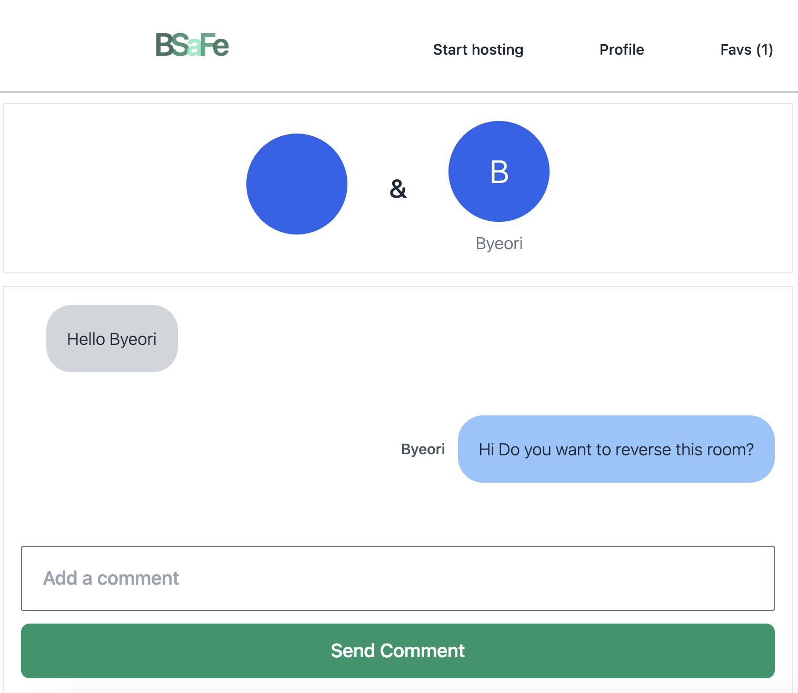
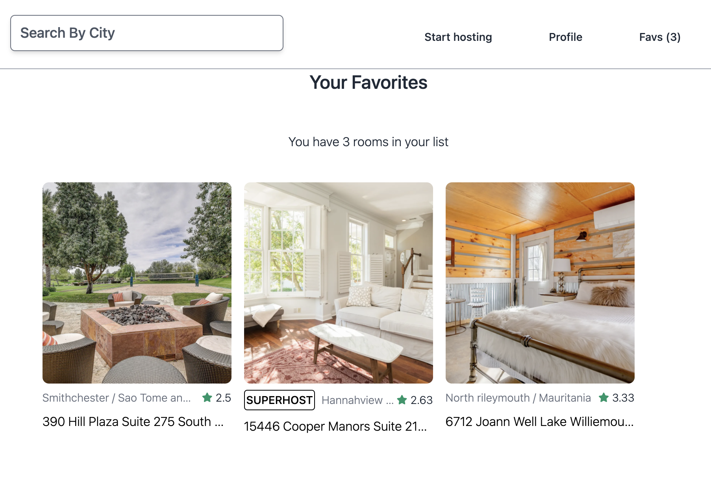

## 숙소 예약 웹사이트 BSaFe

with Python, Django, Tailwind Css

#### Click link below to check this website

http://airbnb-clone.eba-2kktntyc.ap-northeast-2.elasticbeanstalk.com/

### home

#### 페이지 이동을 통해서 전 세계 모든 집들을 볼 수 있습니다.

#### 

### Explore

#### 도시, 나라, 가격, 방 구비 물품 등에 따라 필터를 적용하여 원하는 방을 검색할 수 있습니다.

#### 

### User Login, Logout & SignUp

#### 깃헙, 카카오 계정을 사용하여 소셜 로그인 혹은 이메일을 사용하여 회원 가입/로그인 할 수 있습니다.

#### 

### User Profile

#### 소유한 방에 대한 정보가 있습니다. 프로필을 수정하거나 나의 예약 정보, 나의 대화 목록으로 이동할 수 있는 링크가 있습니다.

#### 

### Become a Host and Upload a New Room

#### 호스트 <-> 게스트 상태에 따라서 방을 예약하거나 호스트가 되어서 자신의 방을 올릴 수 있습니다.

#### 

### Room Detail

#### Room information and Reservation calendar

#### 방의 정보에 대해서 확인하고 원하는 날짜에 예약할 수 있습니다.

### Reservation Detail

#### 예약 후 예약을 확인할 수 있는 페이지가 있습니다. 이 때 호스트에게 메시지를 보낼 수 있습니다.

#### 

### Messages

#### can send messages between host & guest

#### 호스트와 게스트 간 대화를 할 수 있습니다.

### 

### 

### Favorite Lists

#### add or remove rooms from user favorite rooms list

#### 
